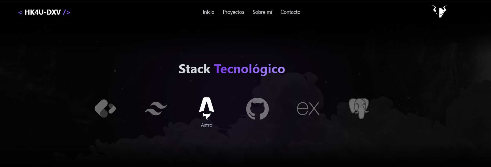

# Portfolio Personal - Gera SSG (Estructura Base en Desarrollo)

<div align="center">




<p align="center">
  <a href="#descripción">Descripción</a> •
  <a href="#-stack-tecnológico">Stack</a> •
  <a href="#instalación">Instalación</a> •
  <a href="#-estructura-base-del-proyecto">Estructura</a> •
  <a href="#-personalización">Personalización</a>
</p>

</div>

## Descripción

Base de portfolio personal desarrollado con Astro, TailwindCSS. Proximamente desplegado con Vercel.

## ⚡ Stack Tecnológico

- **Framework**: [Astro](https://astro.build)
- **Estilos**: [TailwindCSS](https://tailwindcss.com)
- **Animaciones**: [Midudev Animations](https://github.com/midudev/tailwind-animations)
- **Despliegue**: [Vercel](https://vercel.com)

## Instalación

1. Clona el repositorio:

```bash
git clone https://github.com/hk4u-dxv/hk4u-dxv.portfolio.git
```

2. Instala las dependencias:

```bash
pnpm install
```

3. Inicia el servidor de desarrollo:

```bash
pnpm dev
```

## 📁 Estructura Base del Proyecto

```bash
/hk4u-dxv.portfolio
├── node_modules/
├── public/
│   └── images/
├── src/
│   ├── assets/
│   ├── components/
│   │   ├── layout/
│   │   │   └── index.ts
│   │   ├── sections/
│   │   │   └── index.ts
│   │   └── ui/
│   │       └── index.ts
│   ├── layouts/
│   │   └── BaseLayout.astro
│   ├── pages/
│   │   └── index.astro
│   └── env.d.ts
├── .gitignore
├── astro.config.mjs
├── package.json
├── pnpm-lock.yaml
├── tailwind.config.mjs
└── tsconfig.json
```

## Personalización

1. Modifica los colores y estilos en `tailwind.config.mjs`
2. Actualiza el contenido en los componentes de `src/components/sections`
3. Añade tus propias imágenes en `public/images`, `src/assets/images`
4. Personaliza los componentes UI en `src/components/ui`

## 🥷 Autor

<a href="https://github.com/hk4u-dxv">
  
</a>

